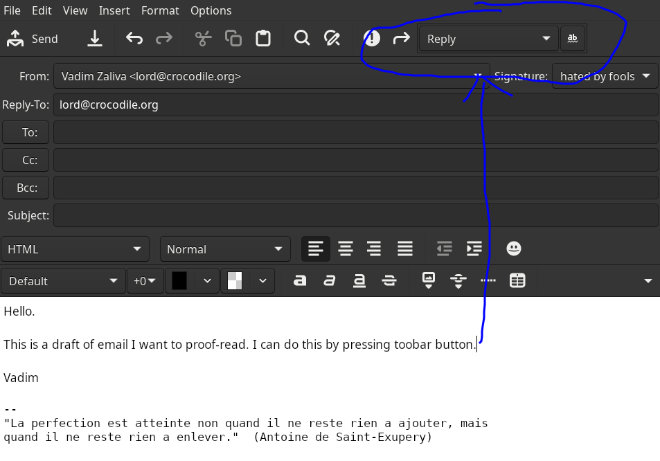

# Evolution AI Proofread Plugin

This plugin adds a "AI Proofread" button to the message composition
toolbar of the Evolution email client. The button allows you to
proofread the email text using OpenAI's GPT API before sending it.



## Configuration

You need to set your OpenAI API key in the authinfo file. The format of the file is:

```
machine api.openai.com login apikey password <key>
```

You need to create a `prompts.json` file in the `ai-proofread/prompts.json` under evolution user config directory. On linux it is `/.config/evolution/ai-proofread/prompts.json`.

The `prompts.json` file should contain an array of prompts. Each prompt should have an id (show in menu and on toolbar combo box) and a text. The text is the prompt text sent to the ChatGPT.

Example:

```json
[
    {"id": "proofread-1", "text": "You are a proofreader. Proofread the following text and return the corrected text."}
]
```

(see `prompts.json` for more examples)

## Usage

Afer installing the plugin, you can use it in Evolution by selecting the prompt from the toolbar combo box and clicking the "AI Proofread" button in the message composition toolbar or using File->AI Proofread menu item.

Currently it inserts the proofread text into the message body at the cursor position. If you want to replace the original text, you need to select the text and click the "AI Proofread" button.

## Building

```
$ mkdir _build && cd _build
$ cmake -DCMAKE_INSTALL_PREFIX=~/.local/share/evolution/modules -DFORCE_INSTALL_PREFIX=ON ..
$ make && make install
```

## Development

To use under vscode first generate `compile_commands.json`:

```
$ cmake -DCMAKE_EXPORT_COMPILE_COMMANDS=ON .
```

## Futurue plans

I primarily use this plugin myself, so the features are tuned for my needs. However I'm open to suggestions and pull requests.
Some ideas:

- Replace all reply text with the proofread text withou need to select it first.
- UI for configuring prompts.
- Support for other LLM providers (e.g. Anthropic).
- UI for configuring LLM provider keys and other options (e.g. model, temperature, etc.).
- Package for Ubuntu and other distros.

## License

This plugin is open-source and licensed under the LGPL License.

## Author

Vadim Zaliva, 2024

